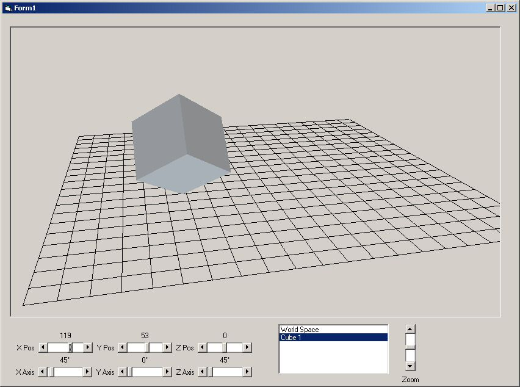

<div align="center">

## Six 3D exersizes


</div>

### Description

Demonstates basic 3D render and animation over 6 progressive exersizes. From a basic worldview grid to multiple 3D objects.
 
### More Info
 


<span>             |<span>
---                |---
**Submitted On**   |2006-07-06 11:19:36
**By**             |[Dion Ving](https://github.com/Planet-Source-Code/PSCIndex/blob/master/ByAuthor/dion-ving.md)
**Level**          |Advanced
**User Rating**    |4.9 (44 globes from 9 users)
**Compatibility**  |VB 6\.0
**Category**       |[Graphics](https://github.com/Planet-Source-Code/PSCIndex/blob/master/ByCategory/graphics__1-46.md)
**World**          |[Visual Basic](https://github.com/Planet-Source-Code/PSCIndex/blob/master/ByWorld/visual-basic.md)
**Archive File**   |[Six\_3D\_exe200476762006\.zip](https://github.com/Planet-Source-Code/dion-ving-six-3d-exersizes__1-65882/archive/master.zip)

### API Declarations

```
Private Declare Function CreatePolyPolygonRgn Lib "gdi32" (lpPoint As pointApi, lpPolyCounts As Long, ByVal nCount As Long, ByVal nPolyFillMode As Long) As Long
Private Declare Function PaintRgn Lib "gdi32" (ByVal hdc As Long, ByVal hRgn As Long) As Long
Private Declare Function DeleteObject Lib "gdi32" (ByVal hObject As Long) As Long
```


